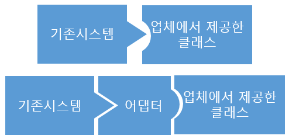

# Adapter Pattern
- 디자인 패턴 중 구조 패턴에 해당
- 호환성이 없는 인터페이스 때문에 함께 동작할 수 없는 클래스들을 함께 작동해주도록 변환

- 적용 사례
  - 외부 라이브러리 (Auth, Payment, Media)
  - 레거시 시스템 부분 확장




- 상속을 하는 경우 클래스 어댑터, 합성을 하는 경우는 객체 어댑터로 구분

## 객체 어댑터 (Object Adaptor)
- 합성(Composition)된 맴버에게 위임을 이용한 어댑터 패턴
- 위임: 자기가 해야 할 일을 클래스 맴버 객체의 메소드에게 다시 시킴으로써 목적을 달성하는 것
- 합성을 활용했기 때문에 런타임 중에 Adaptee(Service)가 결정되어 유연
- Adaptee(Service) 객체를 필드 변수로 저장해야 되기 때문에 공간 차지 비용 존재
- Go 언어는 다중 상속을 지원하지 않으며, 명시적인 인터페이스 구현을 요구하지 않습니다. 따라서 Go에서는 객체 어댑터 패턴을 주로 사용

## 클래스 어댑터 (Class Adaptor)
- 클래스 상속을 이용한 어댑터 패턴
- Adaptee(Service)를 상속했기 때문에 따로 객체 구현없이 바로 코드 재사용이 가능
- 상속은 대표적으로 기존에 구현된 코드를 재사용하는 방식

## 장점
- 프로그램의 기본 비즈니스 로직에서 인터페이스 또는 데이터 변환 코드를 분리할 수 있기 때문에 단일 책임 원칙(SRP)을 만족
- 기존 클래스 코드를 건들지 않고 클라이언트 인터페이스를 통해 어댑터와 작동하기 때문에 개방 폐쇄 원칙(OCP)을 만족

## 단점
- 다수의 새로운 인터페이스와 클래스들을 도입해야 하므로 코드의 전반적인 복잡성이 증가
- 때로는 서비스 클래스를 수정하는 것이 간단할 가능성 존재

## 예제
```go
// 기존에 제공되는 서비스
type LegacyPrinter struct{}

func (lp *LegacyPrinter) Print(s string) string {
    msg := fmt.Sprintf("Legacy Printer: %s", s)
    fmt.Println(msg)
    return msg
}

// 새로운 인터페이스
type ModernPrinter interface {
    PrintModern(s string) string
}

// 어댑터 구조체
type PrinterAdapter struct {
    OldPrinter *LegacyPrinter
}

func (pa *PrinterAdapter) PrintModern(s string) string {
    return pa.OldPrinter.Print(s)
}

// 사용 예
func main() {
    legacyPrinter := &LegacyPrinter{}
    adapter := &PrinterAdapter{OldPrinter: legacyPrinter}

    adapter.PrintModern("Hello, World!")
}

```
