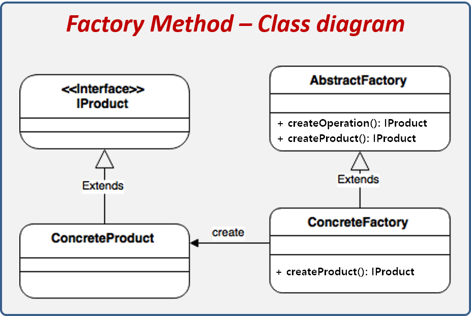
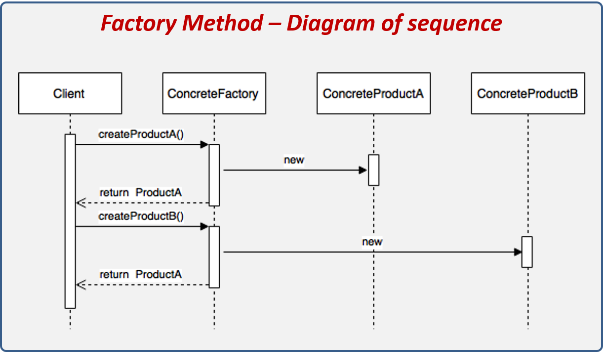

# Factory Method


- 객체 생성을 공장(Factory) 클래스로 캡슐화 처리하여 대신 생성하게 하는 생성 디자인 패턴
- 클라이언트에서 직접 new 연산자를 통해 제품 객체를 생성하는 것이 아닌, 제품 객체들을 도맡아 생성하는 공장 클래스를 만들고, 이를 상속하는 서브 공장 클래스의 메서드에서 여러가지 제품 객체 생성을 각각 책임
- 객체 생성에 필요한 과정을 템플릿 처럼 미리 구성해놓고, 객체 생성에 관한 전처리나 후처리를 통해 생성 과정을 다양하게 처리하여 객체를 유연하게 정할 수 있는 특징


## 장점
- 생성자(Creator)와 구현 객체(concrete product)의 강한 결합 회피 가능
- 팩토리 메서드를 통해 객체의 생성 후 공통으로 할 일을 수행하도록 지정 가능
- 단일 책임 원칙 준수 : 객체 생성 코드를 한 곳 (패키지, 클래스 등)으로 이동하여 코드를 유지보수하기 쉽게 할수 있으므로 원칙을 만족
- 개방/폐쇄 원칙 준수 : 기존 코드를 수정하지 않고 새로운 유형의 제품 인스턴스를 프로그램에 도입할 수 있어 원칙을 만족 (확장성 있는 전체 프로젝트 구성이 가능)

## 단점
- 패턴을 구현하기 위해 많은 새로운 자식 클래스들을 도입해야 하므로 코드 복잡성 증가 가능


## 예제
현재 Citadel에서도 유사하게 사용
```go
package persistence

type persistence interface{
  // something to do
}

var linked persistence

func Link(){
  if linked != nil {
    return
  }

  switch common.Conf.PersistenceKind{
    case common.GoLevelDB:
      linked = NewGoLevelDB()
    case common.PostgreSQL:
      linked = NewPg()
    case common.UnspecifiedPersistence, common.UnknownPersistence:
      fallthrough
    default:
      common.Logger.Panic("unsupported persistence")
  }
}

```