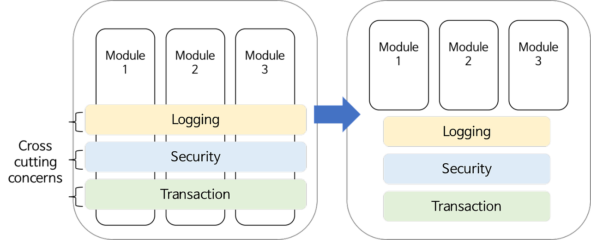
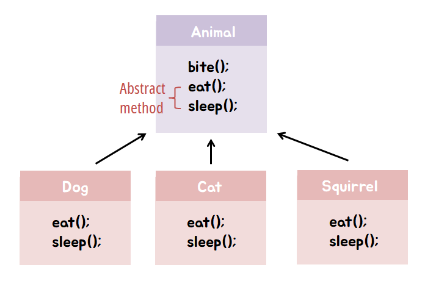
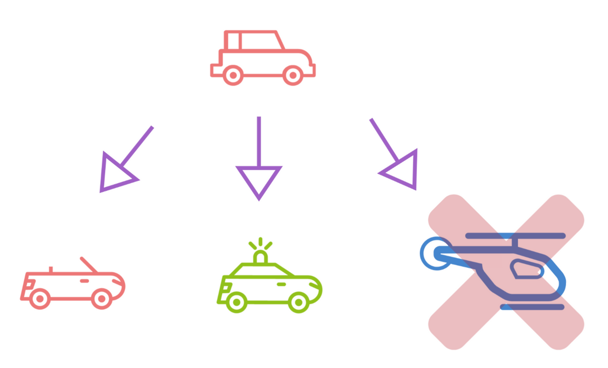
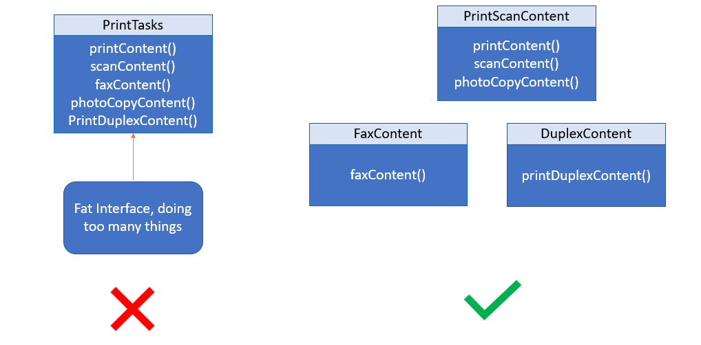
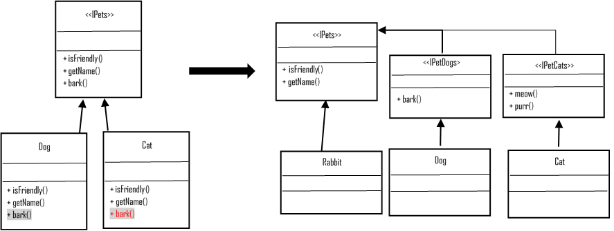

# Solid
- 객체지향 설계에서 지켜줘야 할 5개의 소프트웨어 개발 원칙
  - **SRP(Single Responsibility Principle)**: 단일 책임 원칙
  - **OCP(Open Closed Priciple)**: 개방 폐쇄 원칙
  - **LSP(Listov Substitution Priciple)**: 리스코프 치환 원칙
  - **ISP(Interface Segregation Principle)**: 인터페이스 분리 원칙
  - **DIP(Dependency Inversion Principle)**: 의존 역전 원칙

## SRP(Single Responsibility Principle): 단일 책임 원칙

- **객체**는 단 하나의 책임(기능)만 가져야한다는 원칙
- 하나의 클래스는 하나의 기능 담당하여 하나의 책임을 수행하는데 집중되도록 클래스를 따로따로 여러개 설계
- 만약 이 원칙을 지키지 않는다면 유지보수하는 시점에 결합도가 높아져 연쇄적으로 고쳐야하는 경우가 발생할 가능성이 높다.

## OCP(Open Closed Priciple): 개방 폐쇄 원칙

- 클래스는 확장에 열려있어야 하며, 수정에는 닫혀있어야 한다는 원칙
- 기능 추가 요청이 오면 클래스를 확장을 통해 손쉽게 구현하면서, 확장에 따른 클래스 수정은 최소화 하도록 프로그램을 작성해야 하는 설계 기법이다
- 추상화 사용을 통한 관계 구축을 권장을 의미. 즉, 다형성과 확장을 가능케 하는 객체지향의 장점을 극대화하는 기본적인 설계 원칙

> [ 확장에 열려있다 ]
> - 모듈의 확장성을 보장하는 것을 의미한다.
> - 새로운 변경 사항이 발생했을 때 유연하게 코드를 추가함으로써 애플리케이션의 기능을 큰 힘을 들이지 않고 확장할 수 있다.

> [ 변경에 닫혀있다 ]
> - 객체를 직접적으로 수정하는건 제한해야 한다는 것을 의미한다.
> - 새로운 변경 사항이 발생했을 때 객체를 직접적으로 수정해야 한다면 새로운 변경사항에 대해 유연하게 대응할 수 없는 애플리케이션이라고 말한다.
> - 이는 유지보수의 비용 증가로 이어지는 매우 안좋은 예시이다.
> - 따라서 객체를 직접 수정하지 않고도 변경사항을 적용할 수 있도록 설계해야 한다. 그래서 변경에 닫혀있다고 표현한 것이다.

## LSP(Listov Substitution Priciple): 리스코프 치환 원칙

- 서브 타입은 언제나 기반(부모) 타입으로 교체할 수 있어야 한다는 원칙
  - 다형성 원리를 이용하기 위한 원칙
- 다형성의 특징을 이용하기 위해 상위 클래스 타입으로 객체를 선언하여 하위 클래스의 인스턴스를 받으면, 업캐스팅된 상태에서 부모의 메서드를 사용해도 동작이 의도대로 흘러가야 하는 것을 의미

## ISP(Interface Segregation Principle): 인터페이스 분리 원칙

- 인터페이스를 각각 사용에 맞게 끔 잘게 분리해야한다는 설계 원칙
  - 인터페이스의 단일 책임을 강조
- 인터페이스를 사용하는 클라이언트를 기준으로 분리함으로써, 클라이언트의 목적과 용도에 적합한 인터페이스 만을 제공하는 것이 목표
- 주의해야 할점은 한번 인터페이스를 분리하여 구성해놓고 나중에 무언가 수정사항이 생겨서 또 인터페이스들을 분리하는 행위를 가하지 말아야 한다

## DIP(Dependency Inversion Principle): 의존 역전 원칙
- Class를 직접 참조하는 것이 아니라 그 대상의 상위 요소(추상 클래스 or 인터페이스)로 참조하라는 원칙
  - 현 클래스에 의존하지 말고, 인터페이스에 의존하라는 뜻
- 지향점은 각 클래스간의 결합도(coupling)을 낮추는 것

## Reference
- https://inpa.tistory.com/entry/OOP-%F0%9F%92%A0-%EA%B0%9D%EC%B2%B4-%EC%A7%80%ED%96%A5-%EC%84%A4%EA%B3%84%EC%9D%98-5%EA%B0%80%EC%A7%80-%EC%9B%90%EC%B9%99-SOLID
- https://inpa.tistory.com/entry/OOP-%F0%9F%92%A0-%EC%95%84%EC%A3%BC-%EC%89%BD%EA%B2%8C-%EC%9D%B4%ED%95%B4%ED%95%98%EB%8A%94-SRP-%EB%8B%A8%EC%9D%BC-%EC%B1%85%EC%9E%84-%EC%9B%90%EC%B9%99
- https://inpa.tistory.com/entry/OOP-%F0%9F%92%A0-%EC%95%84%EC%A3%BC-%EC%89%BD%EA%B2%8C-%EC%9D%B4%ED%95%B4%ED%95%98%EB%8A%94-OCP-%EA%B0%9C%EB%B0%A9-%ED%8F%90%EC%87%84-%EC%9B%90%EC%B9%99
- https://inpa.tistory.com/entry/OOP-%F0%9F%92%A0-%EC%95%84%EC%A3%BC-%EC%89%BD%EA%B2%8C-%EC%9D%B4%ED%95%B4%ED%95%98%EB%8A%94-LSP-%EB%A6%AC%EC%8A%A4%EC%BD%94%ED%94%84-%EC%B9%98%ED%99%98-%EC%9B%90%EC%B9%99
- https://inpa.tistory.com/entry/OOP-%F0%9F%92%A0-%EC%95%84%EC%A3%BC-%EC%89%BD%EA%B2%8C-%EC%9D%B4%ED%95%B4%ED%95%98%EB%8A%94-ISP-%EC%9D%B8%ED%84%B0%ED%8E%98%EC%9D%B4%EC%8A%A4-%EB%B6%84%EB%A6%AC-%EC%9B%90%EC%B9%99
- https://inpa.tistory.com/entry/OOP-%F0%9F%92%A0-%EC%95%84%EC%A3%BC-%EC%89%BD%EA%B2%8C-%EC%9D%B4%ED%95%B4%ED%95%98%EB%8A%94-DIP-%EC%9D%98%EC%A1%B4-%EC%97%AD%EC%A0%84-%EC%9B%90%EC%B9%99
