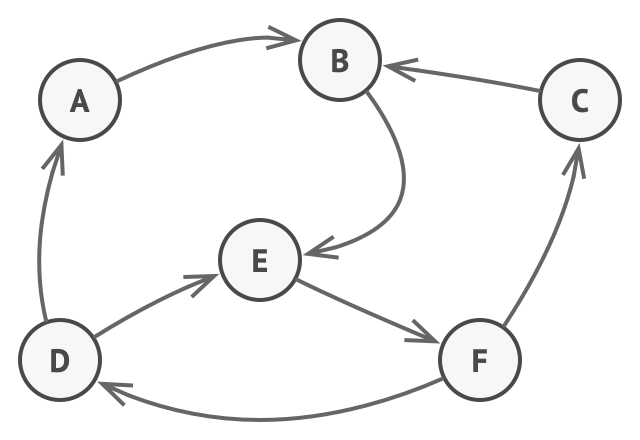

# State

- 객체가 유한한 상태를 가지며, 현재 상태에 따라 동일한 동작이 다르게 실행되는 디자인 패턴.
- 객체는 현재 상태에 따라 동작하며, 상태 간 전이를 통해 동작 방식을 변화
- 상태를 객체화하여 상태 전환을 캡슐화
- 객체 내부에서 상태를 관리
  - 컨텍스트(Context) 객체가 현재 상태를 관리하며, 상태 객체가 스스로 다른 상태로 전환 가능
- 클래스 분리와 책임의 분배
- OCP(Open-Closed Principle, 개방-폐쇄 원칙) 준수
  - 새로운 상태를 추가해도 기존 코드를 수정할 필요 없이 확장 가능
- 전략 패턴과 유사


## 장점
- 상태(State)에 따른 동작을 개별 클래스로 옮겨서 관리 가능
- 상태(State)와 관련된 모든 동작을 각각의 상태 클래스에 분산시킴으로써, 코드 복잡도 감소
- 단일 책임 원칙을 준수 (특정 상태와 관련된 코드를 별도의 클래스로 구성)
- 개방 폐쇄 원칙을 준수 (기존 State 클래스나 컨텍스트를 변경하지 않고 새 State를 도입할 수 있다)
- 하나의 상태 객체만 사용하여 상태 변경을 하므로 일관성 없는 상태 주입을 방지

## 단점
- 상태 별로 클래스를 생성하므로, 관리해야할 클래스 수 증가
- 상태 클래스 갯수가 많고 상태 규칙이 자주 변경된다면, Context의 상태 변경 코드가 복잡도 증가
- 객체에 적용할 상태가 몇가지 밖에 없거나 거의 상태 변경이 이루어지지 않는 경우 불필요

## 예제
```go
package main

import "fmt"

var (
	off    = &Off{}
	orange = &Orange{}
	blue   = &Blue{}
	red    = &Red{}
)

type Lamp struct {
	state LightState // Context
}

type LightState interface {
	ChangeNextState(l *Lamp)
	Shine() string
}

func (l Lamp) Light() {
	fmt.Println(l.state.Shine())
}

func (l *Lamp) PushButton() {
	l.state.ChangeNextState(l)
}

func (l *Lamp) setState(light LightState) {
	l.state = light
}

type Off struct{}

func (*Off) ChangeNextState(l *Lamp) {
	l.setState(orange)
}

func (Off) Shine() string {
	return ""
}

type Orange struct{}

func (*Orange) ChangeNextState(l *Lamp) {
	l.setState(blue)
}

func (Orange) Shine() string {
	return "orange"
}

type Blue struct{}

func (*Blue) ChangeNextState(l *Lamp) {
	l.setState(red)
}

func (Blue) Shine() string {
	return "blue"
}

type Red struct{}

func (*Red) ChangeNextState(l *Lamp) {
	l.setState(off)
}

func (Red) Shine() string {
	return "red"
}

func main() {
	lamp := &Lamp{
		state: off,
	}

	lamp.Light() //
	lamp.PushButton()
	lamp.Light() // orange
	lamp.PushButton()
	lamp.Light() // blue
	lamp.PushButton()
	lamp.Light() // red
	lamp.PushButton()
	lamp.Light() //
	lamp.PushButton()
}

```

## Reference
- https://refactoring.guru/ko/design-patterns/state
- https://inpa.tistory.com/entry/GOF-%F0%9F%92%A0-%EC%83%81%ED%83%9CState-%ED%8C%A8%ED%84%B4-%EC%A0%9C%EB%8C%80%EB%A1%9C-%EB%B0%B0%EC%9B%8C%EB%B3%B4%EC%9E%90
