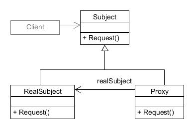

# 프록시 패턴 (Proxy Pattern)

---

## 1. 프록시 패턴이란?

> "프록시 패턴은 다른 객체에 대한 접근을 제어하는 대리자 또는 자리표시자 객체를 제공합니다."

- **프록시(Proxy)**: 대리자, 대변인이라는 의미
- **목적**: 원래 객체에 대한 접근을 제어하고 추가 기능을 제공
- **GoF 디자인 패턴** 중 구조 패턴(Structural Pattern)에 속함

---

## 2. 프록시 패턴의 구조



- **Subject (인터페이스)**: 원본 객체와 프록시가 구현하는 공통 인터페이스
- **RealSubject (실제 객체)**: 실제 작업을 수행하는 원본 객체
- **Proxy (프록시)**: 원본 객체에 대한 참조를 유지하고 접근을 제어

---

## 3. 프록시 패턴의 종류

### 가상 프록시 (Virtual Proxy)

- 비용이 많이 드는 객체의 생성을 지연시킴
- 예: 고해상도 이미지 로딩, 대용량 파일 처리

### 보호 프록시 (Protection Proxy)

- 원본 객체에 대한 접근 권한을 제어
- 예: 인증/인가 시스템, 접근 제어 리스트(ACL)

### 원격 프록시 (Remote Proxy)

- 원격 서버에 있는 객체에 대한 로컬 대리자 역할
- 예: REST API 클라이언트, gRPC 스텁

### 캐싱 프록시 (Caching Proxy)

- 요청 결과를 임시 저장하여 반복 요청 최적화
- 예: 웹 캐시, 데이터베이스 쿼리 캐싱

---

## 4. 프록시 패턴의 장단점

### 장점

- **Single Responsibility Principle**: 관심사 분리 (프록시는 접근 제어, 실제 객체는 비즈니스 로직)
- **Open/Closed Principle**: 원본 객체 코드 변경 없이 새로운 기능 추가 가능
- **보안 강화**: 접근 제어 및 권한 검사 가능
- **성능 최적화**: 캐싱, 지연 로딩 등 성능 개선 기법 적용 가능

### 단점

- **복잡성 증가**: 추가 클래스로 인한 시스템 복잡도 증가
- **응답 지연**: 프록시를 통한 간접 호출로 약간의 성능 오버헤드 발생 가능
- **일부 패턴 구현의 어려움**: 특히 원격 프록시 구현은 복잡할 수 있음

---

## 5. 실제 사용 사례

### 프레임워크 및 라이브러리

- **Spring AOP**: 프록시 기반 관점 지향 프로그래밍
- **Hibernate**: 지연 로딩을 위한 프록시 객체 사용
- **Angular의 HTTP Interceptor**: HTTP 요청 가로채기

### 웹 개발

- **Service Worker**: 오프라인 캐싱 및 요청 중재
- **CORS 프록시**: 교차 출처 요청 처리
- **이미지 최적화 서비스**: 이미지 압축 및 크기 조정

### 클라우드 및 네트워크

- **API Gateway**: 서비스 요청 라우팅 및 관리
- **로드 밸런서**: 트래픽 분산 및 서비스 프록시
- **CDN (Content Delivery Network)**: 콘텐츠 캐싱 및 배포

---

## 6. TypeScript 예제 - 가상 프록시

### 인터페이스 정의

```typescript
// Subject 인터페이스
interface Image {
  display(): void;
  getFileName(): string;
}
```

### 실제 객체 구현

```typescript
// RealSubject 클래스
class RealImage implements Image {
  private fileName: string;

  constructor(fileName: string) {
    this.fileName = fileName;
    this.loadFromDisk();
  }

  private loadFromDisk(): void {
    console.log(`Loading image: ${this.fileName}`);
    // 실제로는 여기서 무거운 이미지 로딩 작업이 일어남
  }

  public display(): void {
    console.log(`Displaying image: ${this.fileName}`);
  }

  public getFileName(): string {
    return this.fileName;
  }
}
```

### 프록시 구현

```typescript
// Proxy 클래스
class ProxyImage implements Image {
  private realImage: RealImage | null = null;
  private fileName: string;

  constructor(fileName: string) {
    this.fileName = fileName;
  }

  public display(): void {
    // 지연 초기화 (lazy initialization)
    if (this.realImage === null) {
      this.realImage = new RealImage(this.fileName);
    }
    this.realImage.display();
  }

  public getFileName(): string {
    return this.fileName;
  }
}
```

---

## 6. TypeScript 예제 - 사용 예시

```typescript
// 클라이언트 코드
function clientCode() {
  console.log('Creating image list...');

  // 프록시를 사용하여 이미지 생성 (아직 로딩되지 않음)
  const images: Image[] = [
    new ProxyImage('photo1.jpg'),
    new ProxyImage('photo2.jpg'),
    new ProxyImage('photo3.jpg'),
  ];

  console.log('Image list created. Images are not loaded yet.');

  // 사용자가 첫 번째 이미지만 클릭하는 시나리오
  console.log('User clicks on the first image:');
  images[0].display(); // 이 시점에 첫 번째 이미지만 로드됨

  console.log('User clicks on the first image again:');
  images[0].display(); // 이미 로드되었으므로 바로 표시

  console.log('Other images remain unloaded.');
}

clientCode();
```

### 출력 결과

```
Creating image list...
Image list created. Images are not loaded yet.
User clicks on the first image:
Loading image: photo1.jpg
Displaying image: photo1.jpg
User clicks on the first image again:
Displaying image: photo1.jpg
Other images remain unloaded.
```

---

## 6. TypeScript 예제 - 보호 프록시

```typescript
// 보호 프록시 예제
interface Document {
  read(): string;
  write(content: string): void;
}

// 실제 문서
class RealDocument implements Document {
  private content: string;

  constructor(content: string) {
    this.content = content;
  }

  public read(): string {
    return this.content;
  }

  public write(content: string): void {
    this.content = content;
  }
}

// 사용자 권한
enum UserRole {
  ADMIN,
  EDITOR,
  VIEWER,
}

// 보호 프록시
class ProtectedDocument implements Document {
  private realDocument: RealDocument;
  private userRole: UserRole;

  constructor(realDocument: RealDocument, userRole: UserRole) {
    this.realDocument = realDocument;
    this.userRole = userRole;
  }

  public read(): string {
    // 모든 사용자는 읽기 가능
    return this.realDocument.read();
  }

  public write(content: string): void {
    // ADMIN과 EDITOR만 쓰기 가능
    if (this.userRole === UserRole.ADMIN || this.userRole === UserRole.EDITOR) {
      this.realDocument.write(content);
      console.log('Document updated successfully');
    } else {
      console.log('Access denied! You do not have write permission.');
    }
  }
}
```

---

## 7. JavaScript의 내장 Proxy 객체

ES6에서 도입된 내장 Proxy 객체를 사용한 구현

```typescript
// TypeScript에서 JavaScript의 Proxy 객체 사용
const user = {
  firstName: 'John',
  lastName: 'Doe',
  email: 'john.doe@example.com',
  role: 'user',
};

// 프록시 핸들러 정의
const handler = {
  get(target: any, prop: string) {
    if (prop === 'fullName') {
      return `${target.firstName} ${target.lastName}`;
    }

    // 민감한 정보 보호
    if (prop === 'email') {
      console.log('Someone is accessing email information!');
    }

    return target[prop];
  },

  set(target: any, prop: string, value: any) {
    // 유효성 검사
    if (prop === 'email' && !value.includes('@')) {
      throw new Error('Invalid email format');
    }

    console.log(`Changed ${prop} from ${target[prop]} to ${value}`);
    target[prop] = value;
    return true;
  },
};

// 프록시 생성
const userProxy = new Proxy(user, handler);

// 사용 예
console.log(userProxy.fullName); // "John Doe"
userProxy.firstName = 'Jane'; // "Changed firstName from John to Jane"
console.log(userProxy.fullName); // "Jane Doe"

try {
  userProxy.email = 'invalid-email'; // 에러 발생
} catch (e) {
  console.error(e.message); // "Invalid email format"
}
```

---

## 8. 요약

### 프록시 패턴의 핵심

- 원본 객체에 대한 간접 접근 제공
- 원본 객체의 로직은 그대로 두고 추가 기능 구현
- 공통 인터페이스를 통한 투명한 사용

### 적용 시나리오

- 리소스 집약적인 객체의 지연 로딩
- 접근 제어 및 권한 관리
- 로깅, 캐싱, 모니터링 등 부가 기능 추가
- 원격 리소스에 대한 로컬 인터페이스 제공

### 주의사항

- 과도한 사용은 시스템 복잡도 증가
- 성능에 민감한 상황에서는 오버헤드 고려
- 프록시 체인이 길어지면 디버깅 어려움
